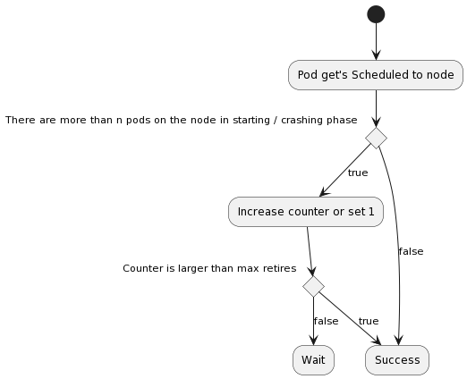

# Thundering Herd Scheduler

The Thundering Herd Scheduler is intended to solve a problem where multiple pods start in parallel on a node and cause high CPU usage during initialization.

Such problems typically occur on Spring Boot applications that during startup consume up to two or three CPU cores and afterwards idle around 0.1-0.5 CPU cores.

Implementing a proper Kubernetes resource limit & request is quite difficult as there are two ways:
* Very low CPU limit: Limiting a Spring Boot during context initialization increases the Startup Time near to exponential
* Very high CPU limit: In this case the app consumes during startup a large number of CPU cores, but afterwards needs near to no resources. So we have a quite high over-provisioning.

To overcome the situation currently there is no real valid solution available: [https://github.com/kubernetes/kubernetes/issues/3312](Github issue)
A real solution at the end could be the following [https://github.com/kubernetes/enhancements/blob/master/keps/sig-node/1287-in-place-update-pod-resources/README.md](KEP) which allows to dynamically update resource limits & requests after startup.
But as it's currently still in an unclear state the Thundering-Herd-Scheduler comes to the rescue.


## How does the Thundering Herd Scheduler Work

The Scheduler acts based on the [https://kubernetes.io/docs/concepts/scheduling-eviction/scheduling-framework/](Scheduling Framework) implemented in Kubernetes.
It implements the Permit Scheduling Cycle with the following logic.



In any case, the scheduler continues the scheduling and starting of the pod after a specified number of retries to prevent a scheduling issue.

## Scheduler Configuration

Configuration of the Scheduler happens via the KubeSchedulerConfiguration:

```yaml
apiVersion: kubescheduler.config.k8s.io/v1
kind: KubeSchedulerConfiguration
leaderElection:
  leaderElect: true
  resourceName: thundering-herd-scheduler
profiles:
  - schedulerName: thundering-herd-scheduler
    plugins:
      permit:
        enabled:
          - name: ThunderingHerdScheduling
        disabled:
          - name: "*"
    pluginConfig:
      - name: ThunderingHerdScheduling
        args:
          parallelStartingPodsPerCore: 0.6 #this means 1.5 core is needed for 1 pod
          timeoutSeconds: 5
          maxRetries: 5
```

The yaml registers a new scheduler named `thundering-herd-scheduler` which follows the process of the default scheduler, but disables all permit Plugins and uses instead the "ThunderingHerdScheduling" Implementation of a Permit Scheduler Plugin.

It's possible to further configure the Scheduler behavior based on arguments. The provided values are the defaults:

| Property                      | Default | Description                                                                                                                                                   |
|-------------------------------|---------|---------------------------------------------------------------------------------------------------------------------------------------------------------------|
| `parallelStartingPodsPerNode` | `nil`   | How many pods should get scheduled in parallel before pods are moved into waiting state                                                                       |
| `parallelStartingPodsPerCore` | `1.0`   | How many pods should get scheduled in parallel per core before pods are moved into waiting state                                                              |
| `timeoutSeconds`              | `5`     | Based on how many times the pod was attempted to be scheduled using the scheduler, a wait is implemented with the following rule `timeoutSeconds^2 * retries` |
| `maxRetries`                  | `5`     | How many times a pod can run through the process before it anyway get's scheduled                                                                             |


## Scheduler Deployment

### Manifest

To deploy the scheduler within your infrastructure jump inside the manifests/installation/deployment.yaml file and add the path to your docker image.

As soon as this is done simply run the following command to start the scheduler in your infrastructure:

```bash
kubectl apply -f manifests/installation/deployment.yaml
```

### Helm chart
The scheduler can be deployed using helm chart.

We currently don't provide a docker image, therefore please first build and push the docker image to your registry of choice.

First add helm chart repository:
```
helm repo add dbschenker https://dbschenker.github.io/thundering-herd-scheduler
```

Then install helm chart, please add to `image.repository` the path of your docker image.
```
helm install -n kube-system thundering-herd-scheduler /thundering-herd-scheduler --set image.repository=my-repo/of-choice
```

Helm chart deployment can be easily parametrized using helm values. Available parameters documentation can be found [here](charts/thundering-herd-scheduler/README.md).

## Scheduler Usage

As soon as the Scheduler is deployed pods can be configured to use this scheduler instead of the default-scheduler.
Therefore a schedulerName needs to be set on a pod or any higher level resource:

```yaml
apiVersion: v1
kind: Pod
metadata:
  name: training-server
  labels:
    name: training-server
spec:
  schedulerName: thundering-herd-scheduler
  containers:
    - name: nginx
      image: daspawnw/training-server:latest
      livenessProbe:
        httpGet:
          port: 8080
          path: "/health"
        initialDelaySeconds: 10
        periodSeconds: 10
      readinessProbe:
        httpGet:
          port: 8080
          path: "/health"
        initialDelaySeconds: 5
        periodSeconds: 10
```

## Versioning

This project is not fully following semantic versioning as it depends on upstream releases of kubernetes.
Versions are tagged with `v{{ KUBERNETES_MAIN_VERSION }}-{{ SEQUENTIAL_THUNDERING_PLUGIN_RELEASE }}`.
SEQUENTIAL_THUNDERING_PLUGIN_RELEASE is counted per KUBERNETES_MAIN_VERSION separately.
For example v1.30.0-1 is 2nd version based on kubernetes 1.30.x.

> **_NOTE:_**  Breaking changes can be introduced by each release. Please check Release notes for details.

